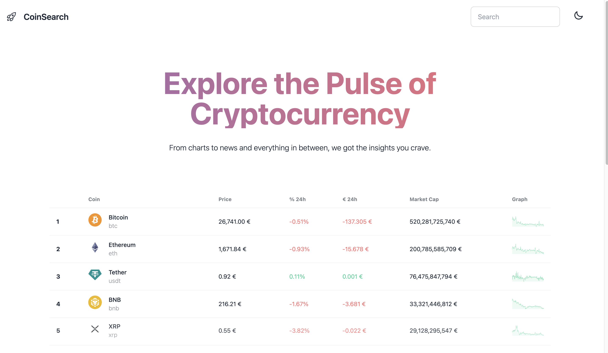

# 🚀 CoinSearh - React Crypto Market Search

CryptoInsight is an elegant and intuitive React application, offering deep insights into the world of cryptocurrencies. Built upon the CoinGecko API, it serves as a comprehensive guide for enthusiasts looking to keep a finger on the pulse of the crypto market. With seamless animations, responsive design, and the flair of dark/light theme toggle, the app brings you an unparalleled user experience.

## 🌟 Features

- **Market Overview**: A table on the main page that showcases coins boasting the highest market cap.
  
- **Trending Coins**: Stay updated with the trending coins, helping you make informed decisions.

- **Top Stable Coins**: A curated list of the most stable coins in the market, bringing you reliability amidst the crypto chaos.

- **Coin Details**: Explore deeper! Every coin's detailed page gives you its current price, price change, and other significant metrics. This section also includes:
    - **Coin Description**: Learn more about what each coin represents and its underlying tech.
    - **Price Trend Graph**: A visually appealing graph plotting the week's price change.

- **Search Functionality**: With a dedicated search in the navbar, effortlessly find and dive into information about your desired coins.

- **Elegant Design & Animations**: A minimalist yet striking design powered by Tailwind CSS, combined with smooth animations achieved via Framer Motion.

- **Dark/Light Theme Toggle**: Personalize your experience; switch between themes as per your mood or ambient lighting.

   
